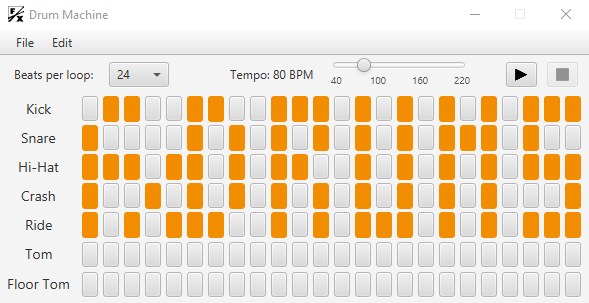

# FXDrums
Simple drum simulator built using JavaFX.
## Screenshots

## Key Features
* Built-in mixer that allows to change the volume separately
* Drum machine to play, save and load drum patterns
* You can use your own .wav files as drums sounds
* Both mouse and keyboard controls
## Built With
* [JavaFX](https://openjfx.io/) - GUI application platform
* [Maven](https://maven.apache.org/) - Dependency management
* [JUnit](https://junit.org/junit5/) - Unit test framework
***
> _The third task of the second term._